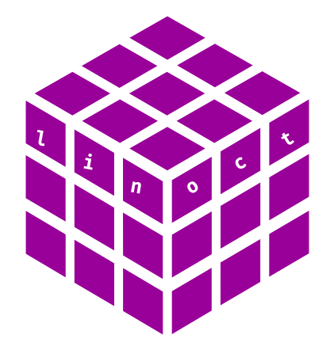

# Linear Octree

<p align="center">
  
</p>


***LinearOctree*** is a C++ library that provides an efficient octree implementation based on the use of Space-Filling Curves (SFC) to improve memory locality, allowing fast access to data.

The library also includes optimized radius and kNN methods utilizing our *linear octree* to perform high-performance neighbourhood searches on large 3D point cloud datasets.

This research organization exists to develop, maintain, and extend the ***LinearOctree*** library ecosystem, which currently includes the aforementioned library and a benchmarking tool for facilitating comparisons between our approach and other methods.


## Citation

If you use this code for any purpose, please properly reference our work:

> Viñambres, P. D., Yermo, M., Alcaraz, S. R., Lorenzo, O. G., Rivera, F. F., & Cabaleiro, J. C. (2026). Efficient Neighbourhood Search in 3D Point Clouds Through Space-Filling Curves and Linear Octrees. arXiv preprint arXiv:2603.06771.

- Bibtex:

    ```bibtex
    @article{Vinambres2026LinearOctree,
    title={Efficient Neighbourhood Search in 3D Point Clouds Through Space-Filling Curves and Linear Octrees},
    author={Vi{\~n}ambres, Pablo D and Yermo, Miguel and Alcaraz, Silvia R and Lorenzo, Oscar G and Rivera, Francisco F and Cabaleiro, Jos{\'e} C},
    journal={arXiv preprint arXiv:2603.06771},
    year={2026}
    }
    ```

## Contact

- Pablo D. Viñambres (✉️ [devderivadas@gmail.com](mailto:devderivadas@gmail.com)) — Main author | Maintainer  
- Miguel Yermo (✉️ [miguel.yermo@usc.es](mailto:miguel.yermo@usc.es)) — Collaborator | Maintainer  
- Silvia R. Alcaraz (✉️ [silvia.alcaraz@inf.ethz.ch](mailto:silvia.alcaraz@inf.ethz.ch)) — Collaborator | Maintainer  


## Copyright
© LinearOctree contributors. All rights reserved.
